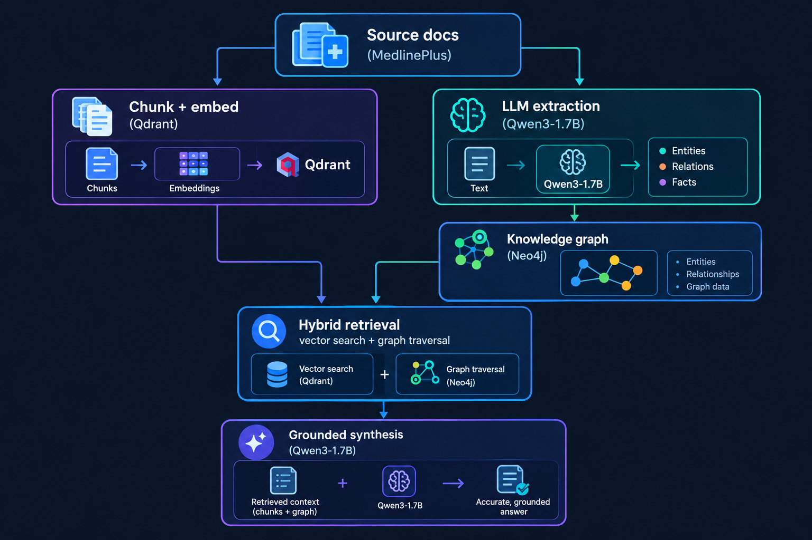

# MultiHopRAG: Hybrid Knowledge Graph + Vector Retrieval
<p align="center">
  
</p>
A retrieval-augmented generation system that combines a knowledge graph with vector
search to answer **multi-hop questions** — questions that require connecting facts
across multiple documents — which plain vector-based RAG cannot reliably answer.

Built entirely on a local stack: Qwen3-1.7B (via Ollama), Qdrant, and Neo4j.
No API keys, no cloud costs, fully reproducible.

---

## The problem

Standard vector RAG retrieves chunks by semantic similarity. This works well for
direct questions ("What does the A1C test measure?") but breaks down on questions
that require chaining facts across documents:

> "What complications can result from the condition that the A1C test diagnoses?"

No single chunk contains this answer — it requires connecting **A1C → diagnoses →
Diabetes → causes → [kidney/eye/nerve complications]**, a path that spans at least
two separate source articles. Vector similarity alone cannot perform this kind of
multi-step reasoning; it can only find text that "sounds like" the question.

This project addresses that gap by extracting a knowledge graph from the same
source documents and combining graph traversal with vector retrieval at query time.

---


## Architecture
<p align="center">
  
</p>
**Ingestion** parses each document, chunks and embeds it into Qdrant, and
separately prompts an LLM to extract `(entity, relation, entity)` triples into
Neo4j, with entity names resolved against the source article's title to reduce
duplicate nodes from synonyms (e.g. "HbA1C" / "A1C" / "Glycohemoglobin").

**Retrieval** always runs vector search, and additionally extracts named entities
from the question and expands outward from them in the graph (1–2 hops). Graph
results that find nothing simply return empty, so the system degrades gracefully
to vector-only behavior rather than depending on a separate (and, as detailed
below, unreliable) multi-hop classifier.

**Synthesis** merges retrieved chunks and graph facts into a single prompt and
instructs the model to answer only from the provided context, explicitly stating
when the context is insufficient rather than guessing.

---

## Tech stack

| Component | Choice | Why |
|---|---|---|
| LLM | Qwen3-1.7B via Ollama | Fully local, zero cost, tests retrieval architecture independent of frontier-model reasoning |
| Embeddings | nomic-embed-text via Ollama | Local, 768-dim, no API dependency |
| Vector store | Qdrant (Docker) | Purpose-built ANN search, has a real dashboard for inspection |
| Graph store | Neo4j (Docker) | Industry-standard graph DB, Cypher for traversal |
| Orchestration | Plain Python | No LangChain/LlamaIndex — demonstrates understanding of the underlying mechanics rather than framework usage |
| Dataset | MedlinePlus (XML export, parsed to per-topic `.txt`) | Natural multi-hop structure: test → condition → treatment → complication chains |

---

## Setup

### Prerequisites
- Docker
- Python 3.10+
- [Ollama](https://ollama.com) installed locally

### 1. Start supporting services

```bash
docker compose up -d
```

This starts Qdrant (`localhost:6333`) and Neo4j (`localhost:7474` browser /
`localhost:7687` bolt), both backed by named Docker volumes so data survives
container restarts.

### 2. Pull local models

```bash
ollama pull qwen3:1.7b
ollama pull nomic-embed-text
```

### 3. Install Python dependencies

```bash
python -m venv venv
source venv/bin/activate
pip install -r requirements.txt
```

### 4. Add data

Download medlineplus xml file from the link:
[Medlineplus](https://medlineplus.gov/xml.html?utm_source=chatgpt.com).
Place MedlinePlus-xml format file in /data

```bash
python ingest/parse_medlineplus.py
```

Now txt files are created (see `data/medical/medlineplus_sample/`)

### 5. Run ingestion

```bash
python run_ingest.py
```

This parses, chunks, embeds, and extracts a knowledge graph from every document.
Expect roughly one LLM call per chunk for extraction — this is the slowest step.
A failure-rate summary prints at the end.

### 6. Verify

```bash
python -m scripts.inspect_qdrant
python -m scripts.inspect_neo4j
```

## 7. Inspecting the databases directly

Both databases expose a browser UI for manually inspecting stored data —
useful for sanity-checking ingestion without writing any code.

### Neo4j Browser — `http://localhost:7474`

Log in with the credentials set in `docker-compose.yml` (default: `neo4j` /
`testpassword`). Useful queries:

```cypher
// Visualize a sample of the graph
MATCH (n) RETURN n LIMIT 100

// Total node and relationship counts
MATCH (n) RETURN count(n) AS total_nodes
MATCH ()-[r]->() RETURN count(r) AS total_relationships

// Check which relation types were actually extracted
MATCH ()-[r]->()
RETURN DISTINCT r.type, count(*) AS c
ORDER BY c DESC

// Inspect one entity and its connections
MATCH (n:Entity {name: "Diabetes"})-[r]-(connected)
RETURN n, r, connected
```

### Qdrant Dashboard — `http://localhost:6333/dashboard`

Shows collections, point counts, and lets you browse stored vectors and their
payloads (source text, document title, URL) directly in the browser, without
needing to query via the client library.

### 8. Run evaluation

```bash
python -m eval.run_eval
```

Outputs `eval/results_summary.json`, `eval/results_detailed.json`, and prints
an accuracy table split by retrieval mode and question type.

### 9. Try it interactively

```bash
uvicorn api:app --reload --port 8000
# or
streamlit run app.py
```

---

## Evaluation methodology

The eval set (`eval/eval_questions.json`) contains hand-written questions split
into `single_hop` (answerable from one chunk) and `multi_hop` (require chaining
through an intermediate entity, deliberately written without naming the bridging
entity directly, so a single lucky vector match can't shortcut the test).

Each question is run through three retrieval configurations — `vector_only`,
`graph_only`, and `hybrid` — using the *same* underlying pipeline with pieces
disabled, so the comparison isolates the retrieval mechanism rather than
comparing different systems. Correctness is scored by keyword matching against
pre-defined expected terms, chosen over LLM-as-judge to keep scoring deterministic
and avoid a small model judging its own output.

---

## Design decisions worth calling out

**Why the multi-hop classifier was removed.** An earlier version routed questions
through an LLM-based single-hop/multi-hop classifier before deciding whether to run
graph expansion. Testing showed Qwen3-1.7B could reason about multi-hop structure
correctly in free-form output, but was unreliable at terse single-word
classification — a format-following limitation, not a reasoning one. Rather than
fight prompt engineering for marginal reliability gains, graph expansion now runs
unconditionally; empty results naturally degrade to vector-only behavior. This
trades a small amount of redundant computation for removing an entire failure
mode (a misclassification silently dropping the graph's contribution).

**Why extraction output is schema-validated, not just parsed.** Raw LLM output
is defensively parsed for valid JSON, then validated against a fixed entity/relation
vocabulary — off-vocabulary relation types and malformed entities are dropped before
writing to Neo4j, rather than trusting whatever the model produced. `format: "json"`
constrained generation (where supported by the Ollama version in use) further
reduces malformed output at the source.

**Why entity resolution is heuristic, not exhaustive.** Entities whose extracted
name matches or is a substring of their source article's title are canonicalized
to the title (e.g. "HbA1C" → "A1C"). This resolves the most common synonym pattern
in MedlinePlus content cheaply, but does not catch all synonyms — a production
version would add embedding-based entity clustering or a dedicated resolution pass.

---

## Known limitations

This is a portfolio/demonstration project, not a clinically validated system.
Specifically:

- **Extraction is prompt-based with a 1.7B parameter model.** Entity and relation
  extraction accuracy has not been validated against a human-labeled gold set;
  the `run_ingest.py` extraction failure rate is tracked but extraction
  *correctness* (as opposed to parse success) is not independently measured.
- **No production-grade error recovery.** Failed extractions are logged and
  skipped rather than retried with fallback strategies or queued for review.
- **Not for medical decision-making.** Content is sourced from MedlinePlus for
  its clean multi-hop structure, not to build a clinical tool. Any real-world
  use of medical information extracted this way would need human-in-the-loop
  validation.
- **Hop-detection is currently absent, not merely simplified** — see the design
  decisions section above. A production system handling real traffic volume
  would likely want *some* cheap pre-filter (even rule-based) purely as a cost
  optimization, since every query currently pays for graph traversal regardless
  of whether it needs it.

---

## Project Structure

```text
multihop_rag/
├── config.py
├── llm.py                  # Ollama wrapper, JSON-constrained generation
├── ingest/
│   ├── parse_medlineplus.py # Parse + strip HTML from source files
│   ├── chunk.py             # Chunk documents, retain metadata
│   ├── embed.py             # Embed chunks, store in Qdrant
│   └── extract_graph.py     # LLM extraction, validation, Neo4j writes
├── retrieval/
│   ├── vector_search.py
│   ├── graph_search.py
│   └── hybrid_retriever.py
├── synthesis/
│   └── answer.py            # Grounded answer generation from merged context
├── eval/
│   ├── eval_questions.json
│   ├── modes.py             # vector_only / graph_only / hybrid configurations
│   ├── judge.py
│   └── run_eval.py
├── scripts/
│   ├── reset_databases.py
│   ├── inspect_qdrant.py
│   └── inspect_neo4j.py
├── run_ingest.py
├── api.py                   # FastAPI backend
├── app.py                   # Streamlit demo
└── docker-compose.yml
```

---

## What I'd add for a production version

- Structured-output APIs (schema-constrained generation) as the primary
  extraction path rather than a fallback, with a larger or fine-tuned
  extraction-specific model
- Human-in-the-loop review queue for low-confidence extractions
- Embedding-based entity resolution instead of title-substring matching
- Extraction precision/recall measured against a labeled gold set, separate
  from end-to-end QA accuracy
- A lightweight, deterministic pre-filter to skip graph traversal on clearly
  single-fact questions, purely as a latency/cost optimization
- Contradiction detection when newly extracted facts conflict with existing
  graph edges

---

## License

MIT